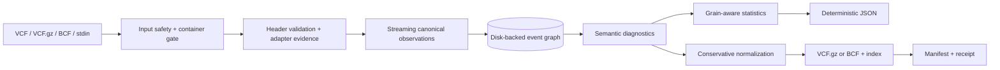

<p align="center">
  
</p>

<h1 align="center">vcf-sv-stats</h1>

<p align="center">
  <strong>Know what your structural-variant callset actually contains.</strong><br>
  Standards-aware inspection, diagnostics, event resolution, statistics, and
  conservative normalization for VCF and BCF.
</p>

<p align="center">
  <a href="https://github.com/lsmc-bio/sv-vcf-stats/actions/workflows/ci.yml"></a>
  
  
  
  <a href="https://github.com/lsmc-bio/sv-vcf-stats/releases/tag/1.1.0"></a>
  
</p>

<p align="center">
  <a href="#the-30-second-tour">Tour</a> ·
  <a href="#why-this-is-different">Why it is different</a> ·
  <a href="#quick-start">Install and use</a> ·
  <a href="#machine-readable-contracts">Contracts</a> ·
  <a href="#contributing">Contribute</a>
</p>

Structural-variant VCFs are often *parseable* long before they are
*interpretable*. One row may describe an allele, one half of a reciprocal
breakend pair, a merged event, or a copy-number segment. Caller conventions
overlap just enough to look compatible—and differ just enough to corrupt a
naive summary.

`vcf-sv-stats` makes those distinctions explicit. It detects producer evidence,
streams records into a canonical observation model, resolves relationships on
disk, reports layered diagnostics, and emits deterministic JSON whose metrics
name their grain and denominator.

> **Current release:** `1.1.0` keeps the stable v1 semantic and artifact
> contracts while making compressed scans leaner. The supported distribution is
> one universal wheel plus `SHA256SUMS` on the GitHub release. No package, Conda,
> or container registry is used.

## The 30-second tour

Run the tool against the bundled, sanitized HG002 Manta fixture:

```bash
uv sync --locked --all-extras
uv run vcf-sv-stats --json stats \
  test_data/vcf/manta.native.hg002.subset.vcf.gz \
  --threads 8 \
  --output /tmp/manta.vcf-sv-stats.json

jq '{
  producer: .callset.producer.producer,
  records: .statistics.source_records.total,
  alleles: .statistics.alleles.total,
  events: .statistics.events.resolved,
  breakends: .statistics.breakends,
  types: .statistics.alleles.types
}' /tmp/manta.vcf-sv-stats.json
```

The result is derived from the committed fixture—not a hand-written mock:

<!-- showcase-json:start -->
```json
{
  "producer": "Manta",
  "records": 100,
  "alleles": 100,
  "events": 97,
  "breakends": {
    "reciprocal_pairs": 3,
    "total": 6,
    "unresolved_mate_references": 0,
    "without_declared_mate": 0
  },
  "types": {
    "BND": 6,
    "DEL": 53,
    "DUP": 4,
    "INS": 37
  }
}
```
<!-- showcase-json:end -->

Why are there 100 records but 97 events? Six BND records form three reciprocal
pairs: six rows, six breakends, three events. The tool keeps each grain visible
instead of collapsing them into a single ambiguous “variant count.”

## Why this is different

| Tempting shortcut | What `vcf-sv-stats` does instead |
|---|---|
| “The parser opened it, so it is valid.” | Reports container, parse, VCF conformance, SV semantics, operation safety, and statistics completeness as separate states. |
| “One VCF row is one variant.” | Counts source records, alternate alleles, breakends, resolved events, genotypes, and analysis units independently. |
| “The filename tells us the caller.” | Ranks header and field evidence; ambiguous or unknown producers stay generic. |
| “A sample column is the sample.” | Keeps VCF genotype columns separate from optional, explicitly mapped analysis context. |
| “Merged support means accuracy.” | Preserves support as provenance and never turns it into precision, recall, or truth concordance. |
| “Normalization can probably fix it.” | Rewrites only when the requested profile, adapter evidence, and relationship graph prove the operation safe. |

The result is a tool that can say **“I do not know”** precisely—which is far
more useful than a confident but biologically wrong number.

## Faster compressed scans, unchanged semantics

`--threads` controls HTSlib/BGZF decompression for compressed VCF and BCF
inputs. The Python semantic scan and cross-record relationship resolution stay
serial, so changing the thread count does not change statistics, diagnostics,
ordering, schemas, or digests.

The bounded 1.1.0 qualification used one indexed, 24-contig,
one-million-record reference-block-heavy gVCF on the same host and input:

| Comparison | Median wall-time result |
|---|---:|
| 1.1.0 threads=1 vs 1.0.1 threads=1 | **25.030870% faster** |
| 1.1.0 threads=8 vs 1.1.0 threads=1 | **0.026662% slower** |

Candidate outputs at threads 1, 2, and 8 were identical, and the released and
candidate semantic payloads matched after normalizing only the producer version
and its dependent digest. See the
[qualification note](docs/benchmarks/20260830_sv_vcf_stats_1_1_0_qualification.md)
and its schema-valid raw receipts.

## One pipeline, explicit trust boundaries



Normal operation reads local files or standard input. It has no telemetry and
does not discover remote data. The only network-capable command is an explicit,
confirmed retrieval of one pinned public reference profile.

## What you get

- **Evidence-ranked adapter detection.** Supported, provisional, unsupported,
  ambiguous, and unknown producers remain distinct states.
- **A canonical observation stream.** Symbolic alleles, sequence-resolved
  alleles, bracket breakends, single breakends, multiallelic rows, filters,
  genotypes, and copy number retain their original meaning.
- **Relationship-aware event counts.** Reciprocal mates can become one event;
  orphan and ambiguous breakends never become invented events.
- **Layered diagnostics.** Stable codes explain severity, category, field,
  fixability, adapter evidence, and whether a finding blocks statistics or
  normalization.
- **Metric contracts.** Every stable metric carries its scope, denominator,
  unit, inclusion rule, and comparability group.
- **Deterministic artifacts.** Canonical JSON, JSON Schema 2020-12, RFC 8785
  hashing, indexed normalized output, transformation manifests, and receipts.
- **Transactional publication.** Output is staged, validated, indexed, and
  committed last; failed replacement restores the prior verified artifact set.
- **A clean library boundary.** `vcf_sv_stats.api.v1` returns immutable models
  or structured exceptions and never exits the host process.

## Quick start

### Install from the GitHub release

Install the exact `1.1.0` wheel in any Python 3.11, 3.12, or 3.13 environment:

```bash
python -m pip install --no-cache-dir \
  "https://github.com/lsmc-bio/sv-vcf-stats/releases/download/1.1.0/vcf_sv_stats-1.1.0-py3-none-any.whl"
vcf-sv-stats version
vcf-sv-stats-verify-install
```

The same wheel URL is the supported Conda path; create a Conda environment and
use its Python interpreter to run pip:

```bash
conda create --yes --name vcf-sv-stats python=3.13 pip
conda run --name vcf-sv-stats python -m pip install --no-cache-dir \
  "https://github.com/lsmc-bio/sv-vcf-stats/releases/download/1.1.0/vcf_sv_stats-1.1.0-py3-none-any.whl"
conda run --name vcf-sv-stats vcf-sv-stats version
conda run --name vcf-sv-stats vcf-sv-stats-verify-install
```

This is pip operating inside Conda, not a native Conda package or channel.
The automatically generated GitHub source snapshots are not the supported
installation artifact for this release.

### Development checkout

The package is not published to a registry. For development from a checkout:

```bash
uv sync --locked --all-extras
uv run vcf-sv-stats --help
uv run vcf-sv-stats info
```

Python 3.11, 3.12, and 3.13 are tested. Runtime dependencies are locked to
public package indexes, including `cli-core-yo==2.1.1` and `pysam==0.24.0`.

### Inspect before you calculate

```bash
uv run vcf-sv-stats --json inspect calls.vcf.gz --max-records 100
uv run vcf-sv-stats --json adapters detect calls.vcf.gz --all-candidates
uv run vcf-sv-stats --json validate calls.bcf
```

`inspect --max-records` is explicitly incomplete. Validation, statistics, and
normalization scan the full selected input.

### Emit a digest-bound summary

```bash
uv run vcf-sv-stats stats calls.vcf.gz \
  --output sample.vcf-sv-stats.json
```

The summary includes the input digest, selected adapter evidence, validation
states, statistics, metric contracts, a content signature, and its own
canonical payload digest. That makes it suitable for downstream aggregation
without asking consumers to reopen the genomic source file.

### Publish exhaustive diagnostics

```bash
uv run vcf-sv-stats discrepancies calls.vcf.gz \
  --output findings.jsonl \
  --format jsonl \
  --fail-on error
```

The report is written before `--fail-on` changes the process exit code, so CI
retains the evidence needed to explain a failed gate.

### Normalize conservatively

```bash
uv run vcf-sv-stats normalize calls.vcf \
  --output calls.normalized.vcf.gz \
  --profile conservative
```

Successful publication creates:

```text
calls.normalized.vcf.gz
calls.normalized.vcf.gz.tbi
calls.normalized.vcf.gz.transforms.json
calls.normalized.vcf.gz.receipt.json
```

The source file is never changed. Input/output aliases, incomplete prior
artifact sets, unsafe adapters, and unsupported rewrite profiles fail before
publication.

### Canonicalize finalized VCF 4.5 multiallelic records

```bash
uv run vcf-sv-stats normalize finalized.vcf.gz \
  --output canonical.vcf.gz \
  --profile canonical
```

Canonical normalization is deliberately narrow: the input must declare the
final VCF 4.5 contract, the selected adapter must permit rewriting, and every
cardinality and relationship must be losslessly remappable. The two-pass,
disk-backed planner splits alternate alleles; remaps `Number=A/R/G/P/LA/LR/LG`,
local alleles, arbitrary supported ploidy, GT and phase state; rewrites IDs,
mates, and events; and emits complete source lineage. Any ambiguity stops before
publication.

For merged callsets, supply a local digest-bound source manifest:

```bash
uv run vcf-sv-stats discrepancies merged.vcf.gz \
  --source-manifest sources.json \
  --output source-comparison.json
```

The comparator reports `preserved`, `not_preserved`, `not_found`, or
`ambiguous`. It never proposes missing evidence for reinsertion.

### Build an atomic report directory

```bash
uv run vcf-sv-stats run calls.vcf.gz --output-dir report
```

The directory is staged as a unit and contains a digest-bound summary, exhaustive
diagnostics, and provenance. Add `--normalize` only when conservative
normalization is valid for the selected callset.

## Python API

```python
from vcf_sv_stats.api.v1 import OperationRequest, stats

result = stats(OperationRequest("calls.vcf.gz", mode="standard"))

print(result.summary["statistics"]["events"]["resolved"])
for finding in result.diagnostics:
    print(finding.code, finding.fixability)
```

The public v1 namespace also exposes inspection, validation, adapter detection,
canonical iteration, discrepancy reporting, normalization, and report bundles.
See the [architecture guide](docs/architecture.md) for the phase model and the
[output contract](docs/output-contract.md) for artifact semantics.

## Caller and merger awareness

| Producer | Tested version | Status | Rewrite policy |
|---|---:|---|---|
| Generic standards adapter | — | supported | conservative; canonical for proven VCF 4.5 |
| Manta | 1.6.0 | supported | conservative; canonical for proven VCF 4.5 |
| TIDDIT | 3.9.7 | supported | conservative; canonical for proven VCF 4.5 |
| dysgu | 1.8.0 | supported | conservative; canonical for proven VCF 4.5 |
| Sniffles2 | 2.8.0 | supported | conservative; canonical for proven VCF 4.5 |
| Sentieon LongReadSV | 202503.03 | supported | conservative; canonical for proven VCF 4.5 |
| Sentieon CNVscope | 202503.03 | supported | conservative; canonical for proven VCF 4.5 |
| Jasmine | 1.1.5 | supported | canonical requires complete source evidence |
| SURVIVOR | 1.0.6 | supported | canonical requires complete source evidence |
| OctopuSV | 0.4.1 | provisional | disabled |
| TrusSV | 0.3.1 | provisional | disabled |
| Severus | — | unsupported | disabled |
| Sentieon short-read SV | — | unsupported | disabled |

Adapter status is not a claim about caller quality. It states how much
versioned evidence this tool has for interpreting that dialect. Inspect the
machine-readable registry with `vcf-sv-stats --json adapters list`.

## HG002 fixture corpus

The repository bundles **21 deterministic source-derived fixtures**, totaling
**1,186 records** and only **180,037 compressed VCF bytes**, plus a
plain/compressed parity pair and a derived BCF. Together they exercise:

- DEL, INS, DUP, INV, TRA, BND, CNV, and caller-specific type variants;
- symbolic, sequence-resolved, breakend, and multiallelic representations;
- reciprocal, orphan, and single breakends;
- PASS, filtered, and missing filter states;
- missing and duplicate IDs, cardinality deviations, genotype and CN states;
- merged support vectors and the caller-specific discrepancies in the
  normative specification.

Every VCF and BCF has exactly one sample named `HG002`. Headers and bodies are
allowlist-rebuilt, identifiers and relationship references are neutralized,
indexes are regenerated, and the manifest binds source and fixture digests.
See [fixture governance](docs/fixture-governance.md) and the
[testing guide](docs/testing.md).

## Machine-readable contracts

| Artifact | Stable identity |
|---|---|
| Summary | `vcf-sv-stats:summary:1` |
| Canonical observation | `vcf-sv-stats.canonical-observation/1.0.0` |
| Source manifest | `urn:vcf-sv-stats:schema:source-manifest:1.0.0` |
| Schemas | `urn:vcf-sv-stats:schema:<artifact>:<version>` |
| Adapters | `urn:vcf-sv-stats:adapter:<producer>:1` |
| VCF metadata | `VCFSVSTATS1_*` |
| Environment | `VCF_SV_STATS_*` |

The digest graph is intentionally one-way:

```text
normalization request
        │
        ├── digest embedded in the output VCF/BCF header
        ▼
transform manifest ── binds input, data, index, mappings, and schemas
        ▼
receipt ───────────── binds request, manifest, and every published artifact
```

For exact fields, validation states, consumer rules, and compatibility policy,
read the [output contract](docs/output-contract.md).

## Privacy and safety defaults

- No telemetry.
- No identity inference from filenames or directory names.
- No raw allele or genotype values in diagnostics.
- No silent producer substitution or compatibility fallback.
- No relationship, genotype, allele, or copy-number invention.
- No recursive deletion during force replacement.
- No network access except an explicit, confirmed public-reference retrieval.
- No bundled reference genome.

Genomic coordinates, genotypes, identifiers, and paths can still be sensitive.
Bug reports should use digests, record ordinals, diagnostic codes, and field
names—not source rows or private paths. See [SECURITY.md](SECURITY.md).

## Documentation

| Start here | Best for |
|---|---|
| [Documentation map](docs/README.md) | Finding the right guide quickly |
| [Operator guide](docs/operator-guide.md) | Practical inspection, reporting, normalization, and recovery |
| [Command reference](docs/command-reference.md) | CLI commands, output behavior, and exit semantics |
| [Architecture](docs/architecture.md) | Processing phases, grains, trust boundaries, and transaction model |
| [Output contract](docs/output-contract.md) | Summary, diagnostics, manifests, receipts, and consumer rules |
| [Fixture governance](docs/fixture-governance.md) | HG002 derivation, sanitization, provenance, and redistribution review |
| [Testing guide](docs/testing.md) | Local matrix, fixture goldens, package and neutrality checks |
| [1.1.0 performance qualification](docs/benchmarks/20260830_sv_vcf_stats_1_1_0_qualification.md) | Bounded one-million-record comparison, parity, and temporary-storage evidence |
| [Distribution guide](docs/distribution.md) | Exact GitHub wheel, checksum, and fresh-install release contract |
| [MultiQC integration](docs/multiqc-integration.md) | Producer/consumer boundary for aggregate reporting |
| [Normative specification](docs/specifications/vcf-sv-stats-1.0.0.md) | 1.0 requirements and stable terminology |
| [1.1.0 release notes](docs/releases/1.1.0.md) | Input-threading boundary and focused performance changes |
| [1.0.1 release notes](docs/releases/1.0.1.md) | Public GitHub wheel installation and qualification |
| [1.0.0 release notes](docs/releases/1.0.0.md) | Historical private-candidate evidence and boundaries |
| [Implementation ledger](docs/plans/20260813T065930Z_sv_vcf_stats_v1_implementation_ledger.md) | Acceptance evidence, completion accounting, and release gates |

## Release boundary

The stable v1 semantic contracts cover finalized VCF 4.5 behavior,
source/merged comparison, canonical multiallelic normalization, native
aggregate reporting, and large-callset qualification. Release `1.1.0` changes
only input decompression threading and redundant scan/EventStore work; it does
not introduce process sharding or a new output contract.

The repository and its GitHub release history are public. Release `1.1.0`
publishes only a universal wheel and its checksum as uploaded GitHub assets. No
package, Conda, container, or signing artifact is published to a registry or
transparency service. Fixture redistribution retains its dated review.

`caller-lossless` remains a reserved, unsupported profile, and every lossy
authorization remains rejected because v1 implements no lossy transform.

## Contributing

Contributions are welcome. The bar is intentionally high: add evidence, define
the grain, preserve provenance, fail loudly when a contract is missing, and
test every claimed behavior. Start with
[CONTRIBUTING.md](CONTRIBUTING.md).

## License

Apache License 2.0. See [LICENSE](LICENSE) and [NOTICE](NOTICE).
