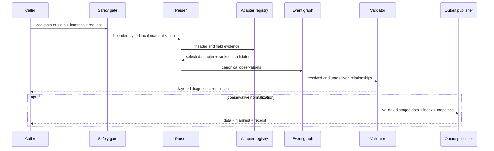

# Architecture

This document explains how `vcf-sv-stats` turns a local VCF or BCF into
auditable observations and artifacts. The [normative specification](specifications/vcf-sv-stats-1.0.0.md)
defines required behavior; this guide explains the implementation shape.

## Design thesis

A trustworthy SV summary requires three things that ordinary VCF aggregation
often skips:

1. preserve the grain of every statement;
2. keep producer evidence separate from standards semantics;
3. publish results only after the entire artifact set proves internally
   consistent.

The implementation therefore uses a linear phase model with fail-closed gates.
Later phases cannot retroactively erase diagnostics produced earlier.



## Domain grains

These grains are deliberately not interchangeable:

| Grain | Definition | Example |
|---|---|---|
| Source record | One VCF row | One half of a reciprocal BND pair |
| Alternate allele | One ALT value on a row | A symbolic `<DEL>` allele |
| Breakend | One oriented junction endpoint | `N]chr2:200]` |
| Event | A resolved biological/representation event | Two compatible reciprocal BND rows |
| Genotype call | One sample column at one row | Diploid `0/1` with declared CN |
| VCF sample | The exact genotype-column name | `HG002` |
| Analysis unit | Optional external analysis context | One explicitly mapped algorithm output |
| Callset | One complete selected input | A local indexed VCF.gz |

The canonical observation model is allele-grained. Relationship resolution is
event-grained. Statistics expose both. This prevents the common error of using
row count as a universal variant count.

## Processing phases

### 1. Input safety

The input must be a local regular file or `-` for standard input. File size and
uncompressed byte ceilings are applied before or during materialization. The
container is identified from bytes, not trusted from the suffix. Output aliases
are rejected by lexical, resolved-path, hard-link, and symlink checks.

### 2. Container and header validation

The reader distinguishes plain VCF, BGZF-compressed VCF, and BCF. Header
inventory records VCF version, contigs, declarations, and exact sample columns.
Parser acceptance is not treated as VCF conformance.

### 3. Adapter detection

Adapters contribute versioned evidence rules and producer-scoped semantics.
Detection returns a selected adapter, ranked candidates, evidence weights, and
an ambiguity flag. Filenames contribute no producer evidence. Low-confidence or
ambiguous detection selects the generic adapter.

An adapter status describes interpretation evidence:

- `supported`: a native versioned fixture passed the support gate;
- `provisional`: detection exists, but rewrite is disabled;
- `unsupported`: the producer identity is reserved without native fixture proof.

Status is not a quality score for the upstream caller.

### 4. Streaming canonicalization

Records stream into immutable `CanonicalObservation` values. Each value retains
source record ordinal, allele ordinal, coordinate, source ID, declared type,
normalized type, representation, applicable length, filter state, and explicit
relationship references.

Unknown or conflicting semantics stay visible. Missing length is not converted
to zero. Single breakends remain distinct from bracket breakends. Small variants
outside the SV/CNV model are labeled `NON_SV` and excluded from event metrics.

### 5. Disk-backed relationship resolution

Relationship state is stored in a temporary SQLite database rather than an
unbounded in-memory graph. Duplicate IDs, `MATEID`, `PARID`, and `EVENT`
relationships are reconciled after streaming input. Compatible reciprocal mates
may resolve to one event; absent or ambiguous evidence remains unresolved.

### 6. Semantic validation

Diagnostics are typed facts with stable codes. Six state axes remain separate:

- container acceptance;
- parser acceptance;
- VCF conformance;
- SV semantic consistency;
- operation safety;
- statistics completeness.

A finding can block normalization without blocking descriptive statistics.
Severity alone never decides operation policy.

### 7. Statistics

Statistics are calculated from canonical observations and resolved events. Every
stable metric declares scope, denominator, unit, and comparability group.
Histograms use explicit half-open boundaries and report `n`, missing, invalid,
and not-applicable observations.

Copy number is factual first: declared CN and genotype state are reported. Gain,
loss, and neutral interpretation remains unavailable without an explicit
baseline contract.

### 8. Optional normalization

The implemented `conservative` profile preserves record cardinality and
semantics. Provisional/unsupported adapters, relationship blockers, aliasing,
and representation-changing profile requests stop before data publication.

The `caller-lossless` and `canonical` names are reserved but unimplemented.
They fail with a structured assessment and do not produce a data file.

### 9. Independent validation and indexing

Staged normalized data is reopened through HTSlib, record counts are reconciled,
and an index is generated. The committed fixture suite is independently checked
with bcftools/HTSlib 1.24 in addition to pysam's bundled HTSlib.

## Publication protocol

Normalization creates four owned artifacts:

```text
data.vcf.gz
data.vcf.gz.tbi
data.vcf.gz.transforms.json
data.vcf.gz.receipt.json
```

The order of trust is one-way:

1. a canonical request digest is embedded in the output header;
2. the transform manifest binds request, source, data, index, schemas, record
   cardinality, and mappings;
3. the receipt binds the request, manifest digest, and published artifact
   digests;
4. the data file is renamed last as the completion marker;
5. the parent directory is synchronized.

Force replacement is allowed only when an existing complete receipt proves the
artifact set belongs to this tool. Prior artifacts move into a private staging
backup; any publication failure removes the new partial set and restores the
prior verified set.

`run` applies the same principle to a report directory: build everything in a
sibling stage, then rename the complete directory once.

## Determinism

Deterministic output depends on:

- stable coordinate and ordinal ordering;
- immutable request models;
- strict configuration without interpolation or unknown keys;
- finite JSON values;
- JSON Schema 2020-12 validation;
- RFC 8785 canonical payload hashing;
- path-safe display names rather than absolute paths;
- explicit versioned bin and schema policies.

Thread-count variation must not change canonical payloads. Repeated
normalization of identical input must preserve semantic output and digest
relationships.

## Trust boundaries

| Boundary | Trusted for | Never trusted for |
|---|---|---|
| File suffix | Display and output-format hint | Input container identity |
| VCF header | Declared fields and producer evidence | Conformance or truth |
| Adapter | Fixture-backed dialect semantics | Biological accuracy |
| Merged support | Provenance | Independent replication or concordance |
| VCF sample column | Genotype-column identity | Analysis-unit identity |
| Receipt | Artifact-set membership and digest reconciliation | Authorship or scientific validity |
| Reference profile | Reference-aware checks | Caller correctness |

## Public API boundary

`vcf_sv_stats.api.v1` is the only intended library import surface. It exposes
immutable request/result models plus inspection, validation, detection,
canonical iteration, statistics, discrepancies, normalization, and report
bundles. Library failures raise structured exceptions; only the CLI translates
them into process exits.

Core code does not import MultiQC. Aggregate consumers receive digest-verified summary
JSON only, as described in [MultiQC integration](multiqc-integration.md).
